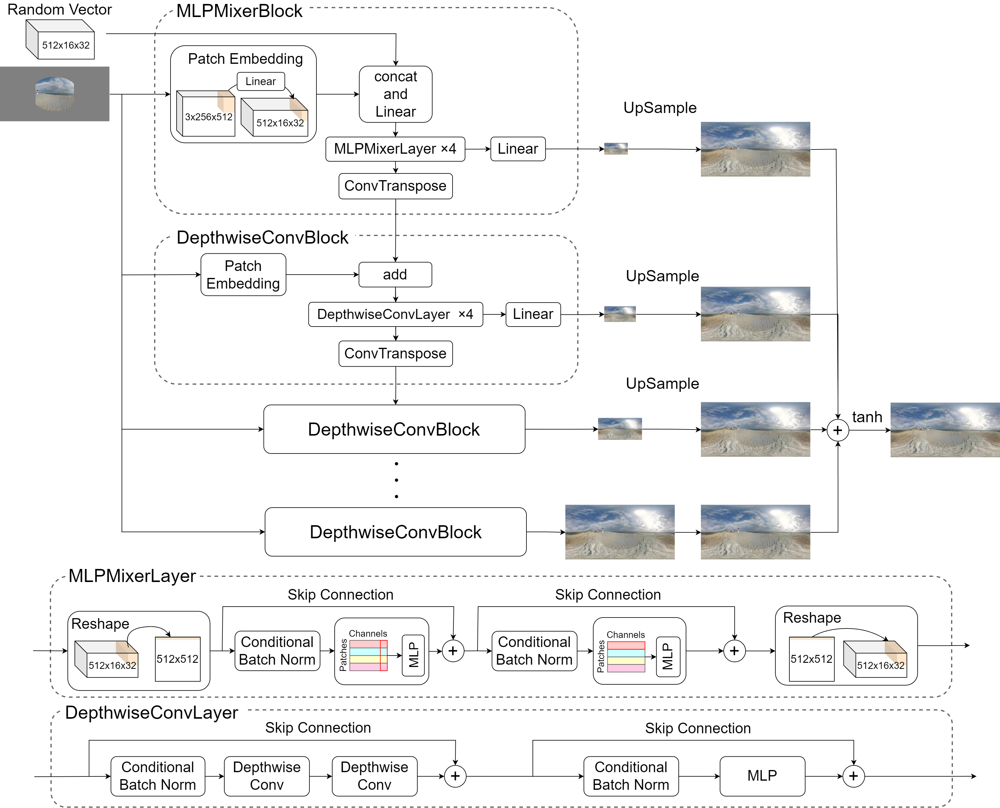

#odigen-mlpmixer

This repository contains the official pytorch implementation of "Increasing diversity of omni-directional images
generated from single image using cGAN based on MLPMixer" in ACPR2023.

- Atsuya Nakata, Ryuto Miyazaki, and Takao Yamanaka, "Increasing diversity of omni-directional images generated from single image using cGAN based on MLPMixer," ACPR2023.


## Sample Images


## Model architecture



## Requirement

* Python 3.8 or avobe 
* PyTorch 1.10.2 or avobe
 
## Installation
  
To install the required packages, run the following command:

```bash
pip install -r requirements.txt
```

Additionally, make sure to install PyTorch from https://pytorch.org/get-started/locally/.

If you are using CUDA 11.3, you can install PyTorch with the following command:

```bash
pip3 install torch==1.10.2+cu113 torchvision==0.11.3+cu113 torchaudio==0.10.2+cu113 -f https://download.pytorch.org/whl/cu113/torch_stable.html
```

## Dataset

The data can be downloaded from the following url :
[Google Drive](https://drive.google.com/file/d/1Te9dsYeIMYlJu0Edh6kfH5WXf6AUJBZB/view?usp=drive_link
)
## Usage

To train the model, use the following command:

```bash
python train.py
```

## Evaluation

To evaluate the trained generator model, follow these steps:

1. Download model weight and calcurated statistics of sun360 from this link : [Google Drive](https://drive.google.com/file/d/1EzKRZWzVYIdXxDWXWv_-d49MXtdX3-A8/view?usp=drive_link
). 
2. Copy the trained generator to the eval/generators directory and rename it to "test.pth".
3. Run the following command from the root directory:

```bash
cd ./eval
python calc_all_metrics.py
```

The evaluation are stored in "eval/evaluation" folder.

## References
- Atsuya Nakata, Ryuto Miyazaki, and Takao Yamanaka, "Increasing diversity of omni-directional images generated from single image using cGAN based on MLPMixer," ACPR2023.
- Keisuke Okubo and Takao Yamanaka, “Omni-Directional Image Generation from Single Snapshot Image,” IEEE International Conference on Systems, Man, and Cybernetics (SMC), 2020, Tronto, Canada (Virtual Conference). [arXiv https://arxiv.org/abs/2010.05600] | [GitHub https://github.com/keisuke-okb/class-conditioned-ODI-generator-pytorch]
